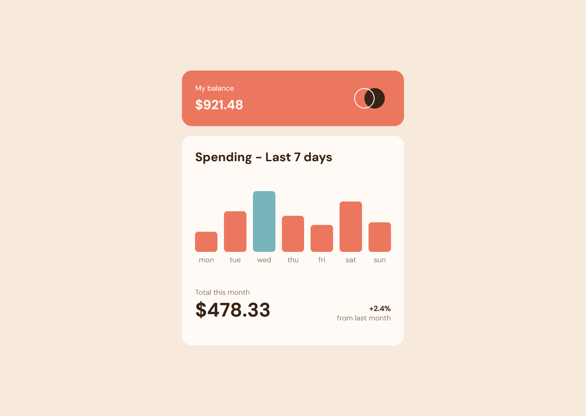

# Frontend Mentor - Expenses chart component solution

This is a solution to the [Expenses chart component challenge on Frontend Mentor](https://www.frontendmentor.io/challenges/expenses-chart-component-e7yJBUdjwt). Frontend Mentor challenges help you improve your coding skills by building realistic projects.

## Table of contents

- [Overview](#overview)
  - [Screenshot](#screenshot)
  - [Links](#links)
- [My process](#my-process)
  - [Built with](#built-with)
- [Author](#author)

## Overview

### Screenshot

### Links

- Live Site URL: [https://luminous-figolla-ea91da.netlify.app/](https://luminous-figolla-ea91da.netlify.app/)

## My process

### Built with

- Semantic HTML5 markup
- CSS custom properties
- Preprocessor SCSS
- JavaScript
- Vue

## Author

- Frontend Mentor - [@StinkyCodeMACHINE](https://www.frontendmentor.io/profile/StinkyCodeMACHINE)
